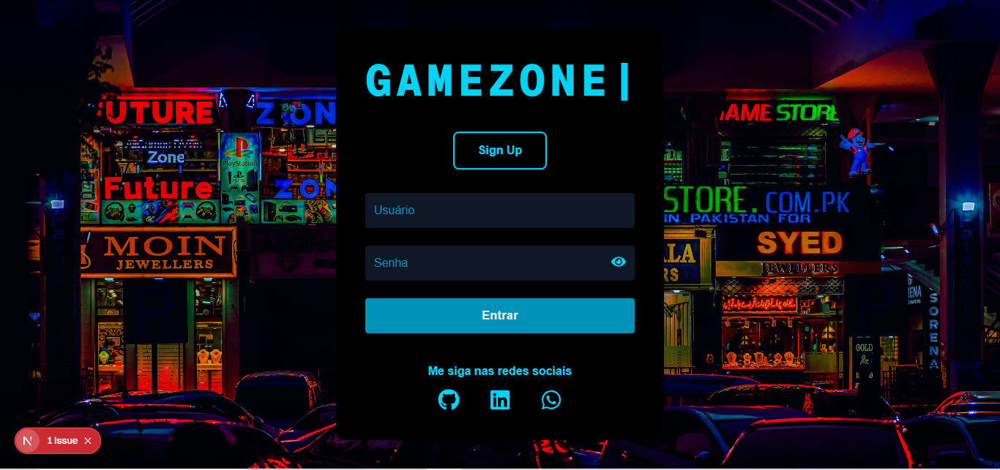
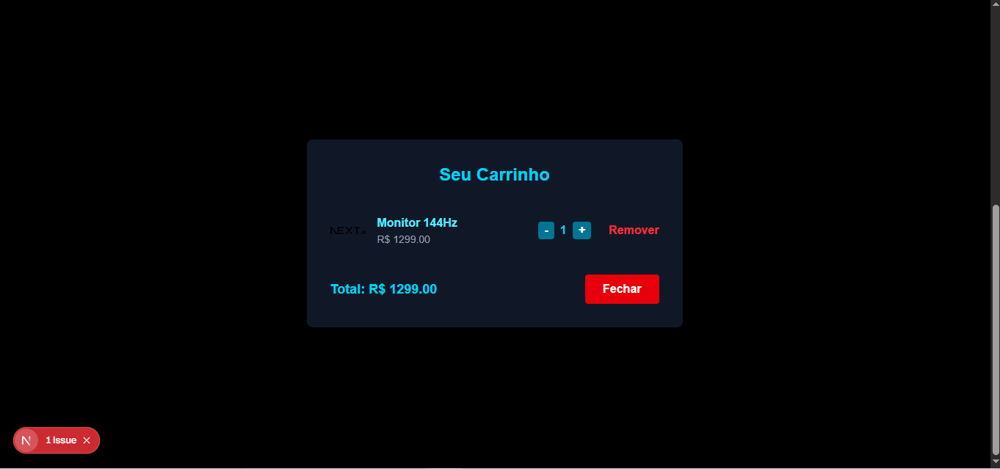

# 🎮 GameZone

Um projeto de **e-commerce gamer** desenvolvido com foco em uma interface moderna e funcionalidades essenciais para login e navegação de usuários.

  
  


---

## 📌 Funcionalidades já implementadas

- Página de Login com autenticação simulada (LocalStorage)
- Redirecionamento automático com base no estado de login
- Página Home com botão de Logout funcional
- Estrutura modular para páginas futuras

---

## 🚀 Tecnologias Utilizadas

- [Next.js 13+ (App Router)](https://nextjs.org/)
- [React](https://reactjs.org/)
- [Tailwind CSS](https://tailwindcss.com/)
- [TypeScript](https://www.typescriptlang.org/)

---

## 🧠 Planejado para as próximas versões

- Página de Cadastro com validação
- Catálogo de produtos gamers
- Carrinho de compras com LocalStorage
- Página de detalhes dos produtos
- Estilização com temas futuristas e animações leves

---

## 📸 Prévia




---

## 📁 Executar localmente

Clone o repositório:

```bash
git clone https://github.com/gustavohrdev/gamezone-frontend.git
cd gamezone-frontend
npm install
npm run dev
